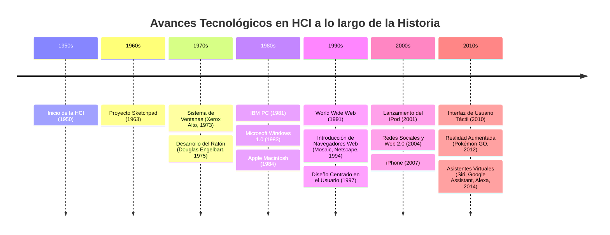
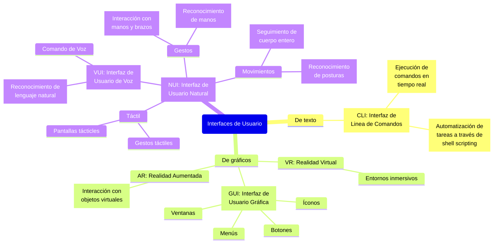

# Historia de la Interacción Humano-Computadora

## Abstract

Este ensayo ofrece una visión comprensiva de la evolución de la Interacción
Humano-Computadora (HCI), una disciplina que busca mejorar la manera en que los
usuarios interactúan con las computadoras y otros dispositivos tecnológicos. La
historia de la HCI comienza en la década de 1940 con los primeros estudios sobre
el hipertexto, pero toma forma concreta en la década de 1970 cuando se acuña el
término HCI. El ensayo destaca hitos importantes en el desarrollo de la HCI,
como la invención del ratón por Douglas Engelbart, la introducción de las
interfaces gráficas de usuario (GUI) por Xerox PARC, y la evolución de los
dispositivos desde las tarjetas perforadas hasta las pantallas táctiles y la
realidad aumentada.

Además, el ensayo explora los diferentes tipos de interfaces que han surgido a
lo largo del tiempo, incluyendo interfaces de línea de comandos (CLI),
interfaces gráficas (GUI), y tecnologías emergentes como la realidad virtual
(VR) y la realidad aumentada (AR). Se discute también la importancia de diseñar
interfaces accesibles, culturalmente adaptadas, éticas y usables, que faciliten
una interacción efectiva y natural. Finalmente, se reflexiona sobre el impacto
futuro de la inteligencia artificial en la HCI, anticipando una transformación
en la manera en que los usuarios interactúan con la tecnología, haciendo las
interfaces más inteligentes y adaptativas.

Este análisis subraya la relevancia continua de la HCI en la creación de
experiencias de usuario más satisfactorias y personalizadas.

## Introducción

La **Interacción Humano-Computadora (HCI)** es una disciplina fundamental en la
tecnología moderna, enfocada en mejorar la relación entre los usuarios y las
computadoras. Desde sus inicios en la década de 1940 con estudios sobre el
hipertexto, hasta los desarrollos actuales que integran inteligencia artificial,
la HCI ha evolucionado significativamente. Este ensayo explora la historia y el
impacto de HCI, destacando avances clave como el ratón, las interfaces gráficas,
y las tecnologías emergentes como la realidad aumentada y los asistentes
virtuales. Además, se analiza la importancia de aspectos como la accesibilidad,
la culturalidad, la ética y la usabilidad en el desarrollo de interfaces que
permitan una interacción más natural y eficiente entre humanos y máquinas.

## Desarrollo

El término HCI se originó en la décadas de los 70's, sin embargo, se considera
que el desarrollo de tecnologías del HCI comenzó a partir de 1945, al empezar un
estudio universitario acerca del **Hypertexto**.

Durante la historia existen una gran diversidad de invenciones y desarrollos
dentro de la HCI, en la fig. 1 se encuentran algunos de los más significativos e
importantes a día de hoy.



### Primer Dispositivo de HCI

Con certeza no se sabe cuál fue el primer dispositivo HCI. Algunos de los
primeros dispositivos HCI fueron la pluma de luz y el muy conocido teclado,
esencial a día de hoy. Sin embargo, varios autores consideran que el primer
dispositivo de HCI fue el ratón. El ratón fue uno de los avances más
significativos y con mayor impacto, debido a que permitió una manera intuitiva y
fácil de interactuar con la computadora, haciendo posible navegar a través de
las interfaces gráficas

### La Evolución de las Interfaces a través de la Historia

Desde la invención de las computadoras, ha sido necesario alguna manera de
comunicarse con las computadoras.

A lo largo de la historia se han desrrollado diversas intefaces HCI, en la fíg.
2 se muestran algunas de las diferentes interfaces de usuario.



#### Tarjetas Perforadas

La primera forma de comunicación fue a través de **tarjetas perforadas**, estas
permitían a los usuarios enviar intrucciones a las computadoras con agujeros. El
aguero representaba el 1 y la ausencia del agujero representaba el 0, lenguaje
el cual entiende la máquina (binario).

#### Terminales e Interfaz de Línea de Comandos (CLI)

Con la evolución de las computadoras, fueron diseñadas las terminales que, los
cuales introdujeron lo que hoy se conoce como **Interfaz de Línea de Comandos
(CLI)**. Estos dispositivos permitian introducir instruccciones al computador a
través de texto, el cual generaba una salida (resultado) que era impreso en
papel.

Con la llegada de las pantallas, las terminales fueron remplazadas por
terminales virtuales (llamadas hoy en día como, consolas, CLI o simplemente
terminales).

Las terminales fueron evolucionando constantemente, permitiendo a día de hoy
realizar tareas de manera eficiente, flexible y versatil. Adicionalmente permite
la automatización de tareas. Por otra parte, estas requieren de esfuerzo y
experiencia por lo que solo son útiles para usuarios avanzados.

#### Interfaz Gráfica

La primera **interfaz gráfica** como la conocemos a día de hoy fue demostrada
por primera vez por Ivan Sutherlan en Sketchpad, la tesis de su doctorado
en 1963. Esta permitía la manipulación de objetos visibles de la pantalla a
través de un dispositivo señalador, el ya mencionado pluma de luz.

En 1973, el centro de investigación de Xerox PARC influyó de manera
significativa en el HCI; introdujo por primera vez el desarrollo de interfaces
gráficas, las cuales ya implementaban ventanas, íconos y punteros.
Adicionalmente perfeccionó el mouse y lo integró con la interfaz gráfica,
introdujo el concepto de **Lo que ves es lo que obtienes (GYSIWYG)**, entre
otras cosas.

La interfaz gráfica es una de las invenciones más importantes en la actualidad,
permitiendo a cualquier usuario interactuar con una computadora de manera fácil,
práctica y amigable.

## Importancia del HCI

El HCI es una discpilina de vital importancia debido a se centra en el diseño y
la mejora de la forma en que las personas interactúan con las computadoras y
otros dispositivos tecnológicos. Algunos de los aspectos clave que considero
importante en el desarrollo de HCI se muestran en la fíg. 3.

```mermaid
graph TD
    A[Aspectos Clave]
  en el Desarrollo
   de HCI]

    A --> B[Accesibilidad]
    A --> C[Culturalidad]
    A --> D[Éticidad]
    A --> E[Usabilidad]

    B --> Ba[
        Diseño de interfaces
        utilizables para la
        mayor cantidad de
        gente posible, sin
        importar sus
        discapacidades.
    ]
    C --> Ca[
        Adaptación de
        interfaces a las
        diferentes culturas,
        p. ej. idiomas,
        colores, fechas
        conmemorativas, etc.
    ]
    D --> Da[
        Desarrollo de
        interfaces que
        manejen
        correctamente la
        información de
        los usuarios.
    ]
    E --> Ea[
        Desarrollo de
        interfaces fáciles de
        usar, para que los
        usuarios puedan
        realizar tareas de
        manera eficiente
        y efectiva.
    ]
```

## Conclusión

En retrospectiva, el HCI es una discpilina la cual estudia la relación que
existe entre los usuarios y las computadoras, el cómo interactuan con el. Esta
busca continuamente mejorar la experiencia de usuario al innovar en el
desarrollo de dispositivos y de interfaces.

Desde mi punto de vista, el estudio de HCI me parece muy interesante e
importante ya que, como desarrollador, ayuda a comprender mejor a los usuarios y
tener una mejor visión acerca del desarrollo de interfaces, haciendo posible
conseguir desarrollar interfaces más acorde a la audencia, brindando una
experiencia más amigable y personalizada.

Para finalizar considero que la HCI va a tener un impacto profundo debido al
reciente auge de la IA, transformando la manera en que los usuarios interactuan
con la tecnología, haciendo las interfaces más inteligentes, adaptativas y
naturales.
