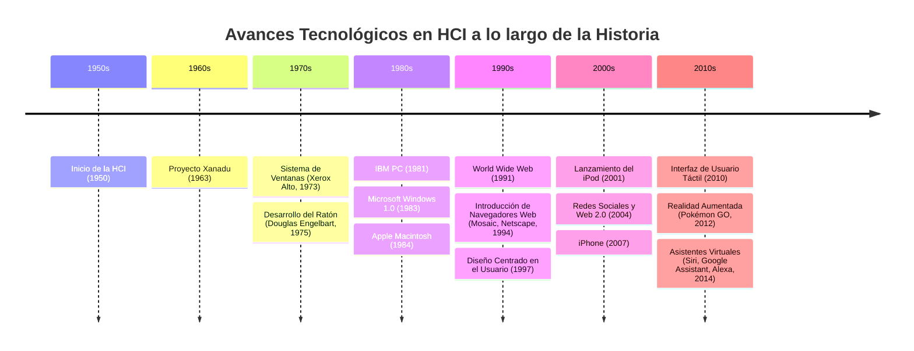
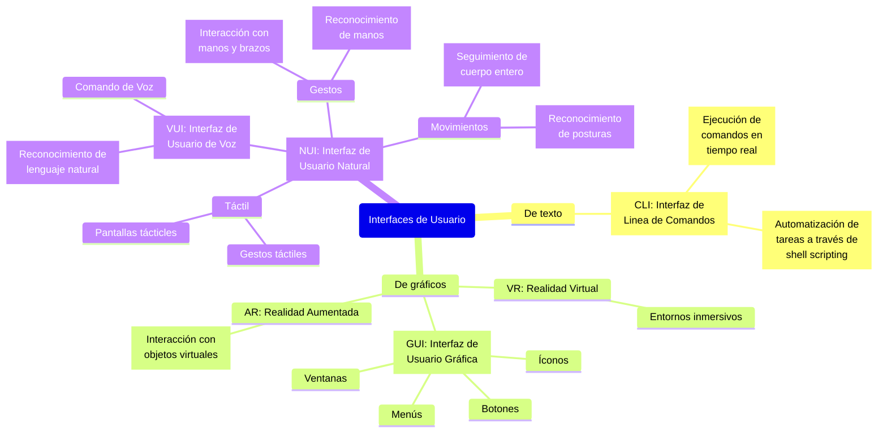
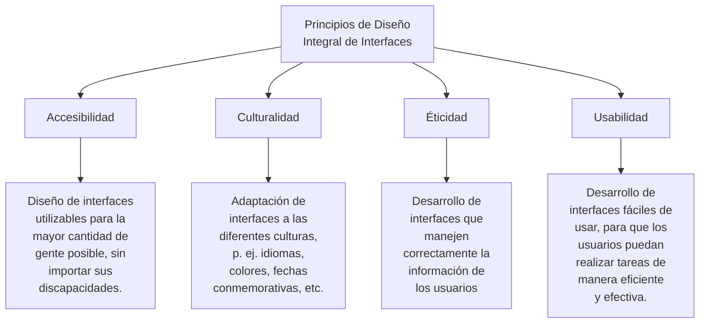

## Cuestionario

- ¿Cuál es considerado el primer dispositivo de interacción humano-computadora?

Si bien los primeros dispositovis de interacción humano

- ¿En qué década se originó el término "Interacción Humano-Computadora"?

En la década de los 70's

- ¿Quién es considerado uno de los pioneros en la HCI por su trabajo en el
  Sketchpad?

Ivan Surtherland

- ¿Qué importancia tuvo el desarrollo del mouse en la historia de la HCI?

Fue algo innovador, permitió una manera muy efectiva e intuitiva de utilizar una
computadora, permitiendo interactuar con interfaces gráficas, a través de la
manipulación de un apuntador.

- ¿Cómo influyó el Xerox PARC en la evolución de la HCI?

Influyo de manera que innovó en el campo de HCI, introduciendo por primera vez
el desarrollo de interfacez gráficas, las cuales implementaban ventanas, íconos
y punteros.

Adicionalmente en Xerox PARC fue dónde se perfeccionó el mouse y se integró con
la interfaz gráfica.

Por último, Xerox PARC introdujo el concepo de WYSIWYG (What You See Is What You
Get), el cual establece que todo lo que veas en pantalla es exactamente lo que
se imprime.

- Describe el papel de la metáfora de escritorio en la HCI.

Esta metáfora se refiere a la idea de diseñar una interfaz de usuario de una
computadora que se asemeje a un escritorio físico, donde los elementos digitales
con representados como objetos familiares del mundo real.

- ¿Qué son las interfaces gráficas de usuario (GUI) y cómo cambiaron la HCI?

Las GUI son aquellas interfaces que permiten interactuar de una manera más
intuitiva y práctica con una computadora. En esta se encuentran elementos tales
como ventanas, íconos, botones, menús, cursores, etc.

Las GUI cambiaron la HCI debido a que permitieron una via más amigable e
intuitiva de interactuar con la computadora. Anteriormente solo se interactuaba
con la computadora a través de una CLI que, si bien son mucho más eficientes,
flexibles y versatiles, estos requieren un mayor esfuerzo y experiencia, por lo
que estos solamente son útiles para usuarios avanzados.

- Menciona un avance significativo en HCI relacionado con la realidad virtual.

Un avance significativo en la Interacción Humano-Computadora (HCI) relacionado
con la realidad virtual (VR) es el desarrollo de sistemas de "realidad virtual
háptica". Estos sistemas permiten a los usuarios no solo ver y escuchar en un
entorno virtual, sino también sentirlo a través de retroalimentación táctil.

Por ejemplo, los guantes hápticos o dispositivos de retroalimentación de fuerza
permiten a los usuarios experimentar sensaciones táctiles, como la textura,
resistencia, y peso de objetos virtuales.

- ¿Cómo ha influenciado la inteligencia artificial en el desarrollo de la HCI?

La inteligencia artificial (IA) ha tenido un impacto profundo en el desarrollo
de la Interacción Humano-Computadora (HCI), transformando cómo los usuarios
interactúan con la tecnología y haciendo las interfaces más inteligentes,
adaptativas y naturales. Algunas formas clave en las que la IA ha influenciado
son:

- Desarrollo de asistentes virtuales y chatbots
- Reconocimiento de lenguaje natural
- Automatización de tareas repetitivas

- ¿Qué es la interacción natural de usuario (NUI) y cómo se diferencia de las
  GUI?

La **Interacción Natual de Usuario (NUI)** es un paradigma de la Interacción
Humano Computadora que permite a los usuarios interactuar directamente con los
dispositivos a través de formas naturales de comunicación, tales como voz,
gestos, movimientos del cuerpo y expresiones faciales.

- ¿En qué consiste el diseño centrado en el humano en HCI?

Es un enfoque de diseño que coloca a las necesidades, deseos, y limitaciones de
las personas en el centro del proceso de desarrollo de productos y sistemas
interactivos. El objetivo principal es crear tecnologías que sean útiles,
usables y agradables para los usuarios finales, asegurando que la tecnología se
adapte a las personas y no al revés.

- Menciona un proyecto o estudio influyente en el campo de la HCI.

El Estudio de Usabilidad del "Walk-Up-and-Use" de ATMs (Cajeros Automáticos),
llevado a cabo en los años 90 por el científico británico John Gould y su
equipo. Este proyecto fue clave para el desarrollo de principios de usabilidad
en sistemas interactivos públicos.

- ¿Qué papel juegan los sistemas de reconocimiento de voz en la evolución de la
  HCI?

Los sistemas de reconocimiento de voz han jugado un papel crucial en la
evolución de la Interacción Humano-Computadora (HCI), transformando cómo los
usuarios interactúan con la tecnología y ampliando significativamente las
posibilidades de interacción más allá de los dispositivos tradicionales como el
teclado y el ratón.

- Explica el concepto de accesibilidad en el contexto de la HCI.

En el contexto de la Interacción Humano-Computadora (HCI), la accesibilidad se
refiere al diseño de tecnologías, interfaces y productos interactivos que sean
utilizables por la mayor cantidad de personas posible, incluyendo aquellas con
diversas discapacidades físicas, sensoriales, cognitivas o tecnológicas.

- ¿Cómo ha impactado la tecnología móvil en las tendencias actuales de la HCI?

Ha impactado de tal manera en que se busca desarrollar sistemas accesibles, que
funcionen correctamente en distintos dispositivos sin importar sus
características y dimensiones.

- ¿Qué es el diseño de interacción y cómo se relaciona con la HCI?

El diseño de interacción es una disciplina dentro de la Interacción
Humano-Computadora (HCI) que se enfoca en crear experiencias de usuario
efectivas y agradables al definir cómo los usuarios interactúan con sistemas
tecnológicos. Se centra en hacer que estas interacciones sean intuitivas,
consistentes y accesibles, aplicando principios de HCI para asegurar que los
sistemas sean fáciles de usar y que cumplan con las necesidades y expectativas
de los usuarios.

- Menciona un desafío ético en el diseño de interacciones humano-computadora.

Uno de los principales desafíos éticos en las interacciones humano-computadora
es la privacidad y el manejo de los datos personales. Si bien muchas veces se
recopilan datos con el fin de mejorar la experiencia de usuario, los
desarrolladores tienen que enfrentar el dilma de cómo y qué tipo de información
recopilar.

- ¿Cómo la HCI aborda las necesidades de usuarios con discapacidades?

Las aborda de manera que promueve la implementación de interfaces que sean
accesibles para todas las personas, independientemente de sus discapacidades.
Algunos ejemplos son los lectores de pantallas o interfaces que permita la
interacción con voz, gestos, etc.

- Describe una técnica de evaluación de usabilidad en HCI.

Una técnica común de evaluación de usabilidad en HCI es la prueba de usuario.
Esta técnica implica observar cómo los usuarios reales interactúan con un
sistema o prototipo para identificar problemas de usabilidad y mejorar la
experiencia del usuario.

- ¿Qué importancia tiene la psicología en el diseño de HCI?

La psicología juega un papel crucial en el diseño de Interacción
Humano-Computadora (HCI) porque proporciona conocimientos sobre cómo las
personas perciben, piensan, sienten y se comportan, lo que es fundamental para
crear interfaces que sean intuitivas, efectivas y satisfactorias de usar.

Menciona un framework popular utilizado en el desarrollo de HCI.

- ¿Cómo ha evolucionado la HCI con el desarrollo de interfaces tangibles?

Las interfaces tangibles han transformado la Interacción Humano-Computadora
(HCI) al llevar la interacción más allá de las pantallas hacia el mundo físico,
permitiendo a los usuarios manipular objetos reales para interactuar con
información digital. Esto ha hecho la interacción más natural, intuitiva y
multisensorial, facilitando la colaboración y mejorando la comprensión dr
conceptos complejos en campos como la educación, la medicina y el diseño.

- ¿Qué papel juega la retroalimentación háptica en la HCI?

La retroalimentación háptica juega un papel crucial en la Interacción
Humano-Computadora (HCI) al proporcionar una dimensión táctil a la interacción
con dispositivos y sistemas, lo que enriquece la experiencia del usuario. Esta
tecnología permite que los usuarios reciban respuestas físicas, como
vibraciones, fuerzas o texturas, en respuesta a sus acciones.

- Describe un caso de uso innovador de HCI en la educación.

Un caso de uso innovador de HCI en la educación es el aprendizaje inmersivo
mediante realidad virtual (VR), que permite a los estudiantes interactuar con
entornos virtuales en 3D para mejorar la comprensión y retención de conceptos
complejos.

- ¿Cómo influyen las emociones y la afectividad en el diseño de HCI?

Influyen en cómo los usuarios perciben, interactúan y se sienten al utilizar un
sistema o producto. Un diseño que considera las emociones puede mejorar la
satisfacción del usuario, fomentar el compromiso y crear experiencias más
memorables.

- Menciona un ejemplo de HCI en el ámbito de la salud.

Un ejemplo destacado es el uso de sistemas de realidad virtual para la terapia
del dolor y la rehabilitación. Se utilizan los VR para sumergirse en entornos
virtuales los cuales están diseñados para distraer su atención del dolos o para
guiar sus ejercicios de rehabilitación de manera efectiva.

- ¿Qué es la gamificación y cómo se aplica en HCI?

La gamificación es el uso de elementos y principios de diseño de juegos en
contextos no lúdicos para motivar y mejorar la participación, el compromiso, y
el logro de objetivos por parte de los usuarios. En el contexto de la
Interacción Humano-Computadora (HCI), la gamificación se aplica para hacer que
la interacción con sistemas y aplicaciones sea más atractiva, motivadora, y
divertida, transformando tareas ordinarias en experiencias más envolventes.

- ¿Cómo la HCI se adapta a las diferencias culturales entre usuarios?

La adaptación de la HCI a las diferencias cultarales es esencial para
proporcionar experiencias efectivas e inclusivas a nivel global. La HCI pueden
adaptarse a otras culturas en base al idioma, los colores, íconos, fechas
locales conmemorativas, entre otros muchos aspectos.

- ¿Qué desafíos presenta la HCI en el contexto de la Internet de las Cosas
  (IoT)?

Los desafíos de HCI en el contexto de IoT incluyen la gestión de la diversidad
de dispositivos y interfaces, garantizar la seguridad y privacidad de los datos,
asegurar la interoperabilidad y compatibilidad entre dispositivos, adaptar la
interacción al contexto del usuario, mantener la simplicidad y usabilidad, y
manejar la escalabilidad y la eficiencia de la red.

- ¿Cómo ves el futuro de la HCI y qué tecnologías emergentes jugarán un papel
  clave?

Desde mi punto de vista, considero que el futuro de la HCI va encaminado al
desarrollo e implementación de tecnologías emergentes tales como la realidad
aumentada y la realidad aumentada; a su vez considero que el auge de la
inteligencia artificial conllevará a una evolución de las HCI, convirtiéndolas
en una experiencia más personalizada y enriquecedora.

## Diagramas

---

