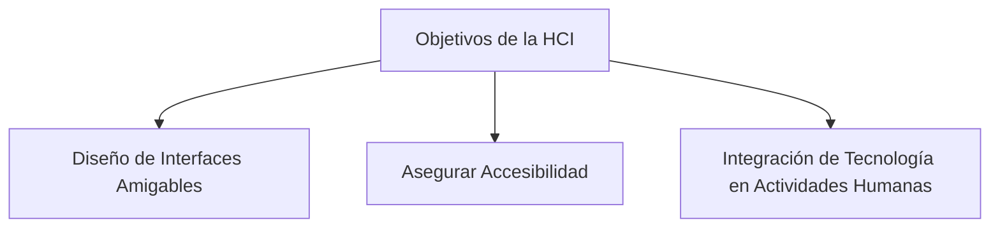
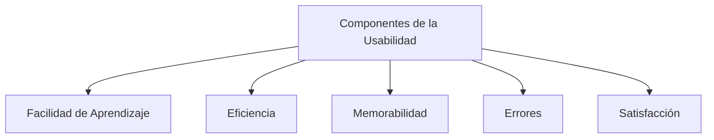

# Tipos de Interacción Humano-Computadora

## Abstract

La Interacción Humano-Computadora (HCI) es una disciplina clave que busca
mejorar la comunicación entre las personas y la tecnología, enfocándose en el
diseño de interfaces accesibles, usables y satisfactorias. A través de un ciclo
de vida iterativo, HCI integra métodos de investigación como pruebas de usuario
y entrevistas para comprender mejor las necesidades y expectativas de los
usuarios. Con la evolución de tecnologías emergentes como las interfaces de
usuario naturales y la realidad aumentada, HCI sigue adaptándose para ofrecer
experiencias más intuitivas y naturales. Además, el diseño inclusivo y la
accesibilidad son fundamentales para garantizar que la tecnología sea accesible
para todos, haciendo de HCI un campo vital en la creación de sistemas
tecnológicos eficientes y universales.

## Introdución

La Interacción Humano-Computadora (HCI) es una disciplina esencial en el mundo
actual, donde la tecnología se ha integrado profundamente en nuestras vidas
diarias. Su estudio y aplicación buscan facilitar una comunicación eficiente y
natural entre las personas y los dispositivos computacionales, asegurando que
estas herramientas sean accesibles, usables y satisfactorias para todos los
usuarios.

## Desarrollo

La HCI es una disciplina muy importante debido a que es una herramienta
fudamental que ayuda a implementar un desarrollo de sistemas que ofrezcan una
experiencia de usuario óptima y que cumplan con los requisitos funcionales.
Algunos de sus principales objetivos se muestran en la fíg. 1

Uno de los aspectos fundamentales de HCI es su enfoque en el diseño de
interfaces amigables y accesibles, un objetivo que se logra mediante un ciclo de
vida iterativo que, como se musetra en la fíg. 2, abarca tres fases:

Además, HCI se apoya en métodos de investigación como las pruebas de usuario y
las entrevistas, que proporcionan una comprensión profunda de las necesidades y
expectativas de los usuarios. Estas técnicas permiten identificar áreas de
mejora en los sistemas diseñados, garantizando que sean intuitivos y eficaces.

La **usabilidad** se refiere a la medida en que un producto puede ser utilizado
por usuarios específicos para lograr sus objetivos de manera efectiva, eficiente
y satisfactoria en un contexto particular de uso.

Jakob Nielsen, un destacado experto en usabilidad, identifica **cinco
componentes clave** que definen la usabilidad. Veáse la fíg. 3.

Cada uno de estos elementos contribuye a la creación de sistemas que no solo
sean funcionales, sino que también brinden una experiencia agradable y sin
complicaciones a los usuarios.

El diseño centrado en el usuario (UCD) es un enfoque que coloca las necesidades
y expectativas de los usuarios en el centro del proceso de diseño, asegurando
que cada aspecto del sistema esté alineado con la comodidad y eficiencia del
usuario.

Las tecnologías emergentes, como las interfaces de usuario naturales (NUIs) y la
realidad aumentada (AR), están transformando la HCI al ofrecer formas más
intuitivas y naturales de interacción. Estas innovaciones prometen cambiar
radicalmente cómo las personas interactúan con la tecnología, haciendo que la
comunicación entre humanos y máquinas sea más fluida y menos dependiente de
interfaces tradicionales.

Finalmente, la accesibilidad y el diseño inclusivo son pilares fundamentales en
HCI. Diseñar para todos, incluyendo personas con diversas discapacidades,
asegura que la tecnología sea verdaderamente universal y no excluya a ningún
grupo. Este enfoque no solo es ético, sino que también amplía el alcance y la
utilidad de los sistemas diseñados.

## Conclusión

En conclusión, la Interacción Humano-Computadora es una disciplina vital que
sigue evolucionando con el avance de la tecnología. A medida que las interfaces
y experiencias se vuelven más complejas, el enfoque en la usabilidad,
accesibilidad y satisfacción del usuario se vuelve aún más crucial. La HCI no
solo mejora la relación entre humanos y computadoras, sino que también moldea el
futuro de cómo interactuamos con el mundo digital que nos rodea.
